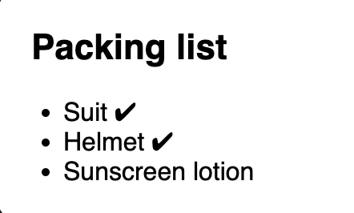

### **React**
- React is the library for web and native user interfaces. Build user interfaces out of individual pieces called components written in JavaScript.

### **React flow**

- **State** controls the condition to render the **View**, Where users can interact with via actions like: clicking a button, submit a form, hover a mouse over an element,... Which lead to change the **State** and update the **View**. 

### **React Component Structure**
- React Component is an unit that control the flow of fetching data, transform data and represent data on the UI.
- Components accept inputs called **props** and return React Elements describing what should appear on the screen.
```jsx
function Welcome(props) { // child component
  return <h1>Hello, {props.name}</h1>;
}

function Display() { // parent component
  return <Welcome name='World'> // <h1>Hello, World</h1>
}
```

- To control the condition to display **View**, we use **State**, and by **Actions** on the **View**, users can update **State**
```jsx
import { useState } from 'react';

function Count() {
  const [count, setCount]  = useState(0); // an initial State count is 0
  function increaseCount() {
    setCount((prev) => prev + 1)
  }
  return (  // return a React Component will render View
    <button onClick={handleCLick}>  { // an Action is set on clicking the button }
      Count: {count}
    </button>
  )
}
```
Explaination: This **Count** component displays a button (***View***) with a number of *count* in it. Whenever the button is clicked (***Action***), the *count* (***State***) will increase by one and update into the screen.

- Another way to display View on the UI conditionally is by using **Conditional Rendering**
```jsx
function Item({ name, isPacked }) {
  if (isPacked) {
    return <li>{name} ✔</li>;
  }
  return <li>{name}</li>;
}
function PackingList() {
  return (
    <section>
      <h1>Packing list</h1>
      <Item name='Suit' isPacked={true}>
      <Item name='Helmet' isPacked={true}>
      <Item name='Sunscreen lotion' isPacked={false}>
    </section>
  )
}
```


- Beside **Conditional Rendering**, we can use Javascript function ***Array.prototype.map()*** or ***Array.prototype.filter()*** to transform or filter a list before displaying it. [Filter and Map list](https://react.dev/learn/rendering-lists)
- Note: Keeping Component ***Pure*** to prevent side effects. [Keeping component pure](https://react.dev/learn/keeping-components-pure)
- Note: It is common to call a component with some local state "uncontrolled" because its parent can not influence its behavior. In contrast, a component is considered "controlled" when the important information in it is driven by props rather than its local state. This lets the parent component fully specify its behavior. Therefore the "controlled component" is more flexible and requires more configuration than "uncontrolled component".

### **Your UI as a Tree**

- Like browsers which use tree structures to model HTML (DOM) and CSS (CSSOM), React also tree structures to manage the relationship between components. Example:
```jsx
function ComponentB() {
  return <h1>Component B</h1>
}
funciton ComponentC() {
  return <h1>Component C</h1>
}
function ComponentA() {
  <section>
    <ComponentB />
    <ComponentC />
  </section>
}
```


- As we nest components, we have the concept of parent and child components, where each parent components may itself be a child of another component. This model is known as **The render tree** (In legacy documentation - React v17 and before, it's called Virtual DOM - React DOM)
- Components are rendered from top to bottom in **the render tree**, when a component has its prop or state changed, that component and its children components will be re-rendered.
- Note: Top-level components are the components nearest to the root component and affect the rendering performance of all the components beneath them and often contain the most complexity. Leaf components are near the bottom of the tree and have no child components and are often frequently re-rendered.